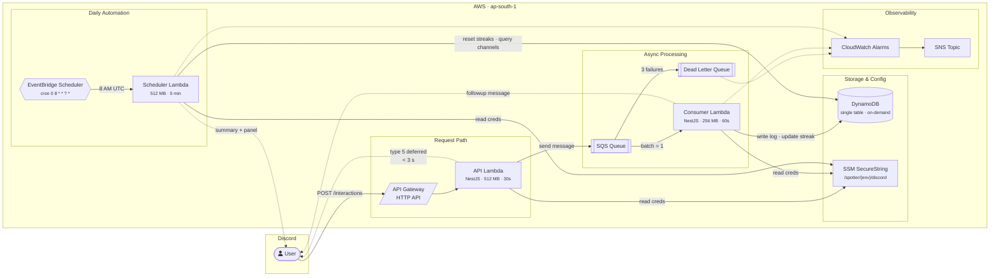

# Spotter

> A serverless Discord bot for tracking daily fitness activity, streaks, and server leaderboards.

[](https://github.com/kumarajith/Spotter/actions/workflows/ci.yml)
[](https://github.com/kumarajith/Spotter/actions/workflows/deploy.yml)


Members log workouts by clicking buttons on a daily panel. Spotter tracks consecutive-day streaks, resets when activity lapses, and posts a leaderboard. The entire backend runs on AWS Lambda — zero idle compute, scales to zero when unused.

---

## Features

- **One-click activity logging** — button panel posted daily with configurable activity types
- **Streak tracking** — per-user consecutive-day streaks; up to 5 rest-only days before a break
- **Milestone celebrations** — in-channel messages at 7, 14, 30, 50, and 100-day milestones
- **30-day heatmap** — visual grid of active vs rest days per user via `/streak`
- **Leaderboard** — current and all-time best streaks via `/leaderboard`
- **Custom activities** — server admins can add and remove activity types
- **Backfill** — log a missed past date and have the streak recomputed correctly
- **Daily automation** — panel reposts at 8 AM UTC with an active-streak summary

---

## Architecture



### Key design decisions

| Decision | Rationale |
|---|---|
| Webhook interactions over Gateway | Serverless-native — no idle process, scales to zero |
| SQS between API and Consumer | Decouples Discord's 3 s deadline from DynamoDB writes |
| Single DynamoDB table | All entities in one table with SK prefix routing; one env var, one IAM grant |
| Pre-computed streaks | DynamoDB has no aggregation — write-time O(1) vs read-time scan of all logs |
| EventBridge Scheduler (not Rules) | Native timezone support, per-schedule DLQ, flexible invocation windows |
| SSM over Secrets Manager | Equivalent security at $0 vs $0.40/secret/month |

---

## Tech Stack

| Layer | Technology |
|---|---|
| Runtime | Node.js 24, TypeScript |
| Framework | NestJS 11 |
| HTTP Lambda | `@codegenie/serverless-express` |
| Cloud | AWS Lambda, API Gateway (HTTP API v2), DynamoDB, SQS, EventBridge Scheduler, SSM, CloudWatch |
| IaC | AWS CDK v2 (TypeScript) |
| CI/CD | GitHub Actions + OIDC (no stored AWS credentials) |
| Local dev | LocalStack via Docker |

---

## Getting Started

### Prerequisites

- Node.js 24+
- [Docker Desktop](https://www.docker.com/products/docker-desktop/)
- A Discord application ([Developer Portal](https://discord.com/developers/applications))

### 1. Install dependencies

```bash
npm install
```

### 2. Configure environment

```bash
cp .env.example .env
```

Edit `.env` with your Discord credentials from the Developer Portal:

```env
DISCORD_BOT_TOKEN=
DISCORD_APPLICATION_ID=
DISCORD_PUBLIC_KEY=
```

### 3. Start local environment

```bash
npm run local
```

This starts LocalStack (DynamoDB + SQS), provisions the table and queue, then runs the API server and SQS consumer in parallel with labeled output.

```
[API]      NestJS application listening on port 3000
[CONSUMER] Polling SQS at http://localhost:4566...
```

**Subsequent runs** (Docker already running):

```bash
npm run dev
```

### 4. Register slash commands

```bash
npm run commands:register
```

Set `DISCORD_GUILD_ID` in `.env` for instant guild-scoped registration during development. Leave it unset for global registration (takes up to 1 hour to propagate).

### 5. Expose local server to Discord

Discord must be able to reach your local endpoint to send interactions:

```bash
ngrok http 3000
```

Set the resulting HTTPS URL + `/interactions` as the **Interactions Endpoint URL** in your Discord application settings.

---

## Discord Commands

| Command | Description |
|---|---|
| `/setup` | Post the activity tracker panel in the current channel |
| `/addactivity <name> <emoji>` | Add a custom activity for this server |
| `/removeactivity <name>` | Remove a custom activity (with autocomplete) |
| `/streak [user]` | Streak stats and 30-day activity heatmap |
| `/leaderboard` | Top 10 current streaks and all-time bests |
| `/backfill <date> <activity>` | Log a past date and recompute the streak |

---

## Deployment

### One-time setup

**1. Bootstrap CDK** in your AWS account:

```bash
cd infra && npx cdk bootstrap aws://<account-id>/ap-south-1
```

**2. Create the Discord SSM parameter:**

```bash
aws ssm put-parameter \
  --name "/spotter/dev/discord" \
  --type SecureString \
  --value '{"botToken":"...","publicKey":"...","applicationId":"..."}'
```

**3. Set up GitHub Actions OIDC** (one-time, no stored credentials):

Create an IAM OIDC identity provider for `token.actions.githubusercontent.com`, then create an IAM role `GitHubActionsRole` with CDK deploy permissions and a trust policy scoped to this repository. Add the role ARN as a GitHub secret: `AWS_ROLE_ARN`.

### Deploy

```bash
# Dev
npm run infra:deploy:dev

# Prod (via GitHub Actions — requires manual approval in GitHub environment "prod")
git push origin main
```

### CI/CD pipeline

| Trigger | Action |
|---|---|
| Pull request to `main` | Lint → Test → Build → CDK synth |
| Merge to `main` | Deploy dev (automatic) → Deploy prod (manual approval) |

---

## Project Structure

```
├── src/
│   ├── lambda.ts                       # API Lambda entry point
│   ├── app.module.ts
│   ├── discord/                        # Interaction handler, signature guard, command routing
│   ├── activity/                       # Activity CRUD (/addactivity, /removeactivity)
│   ├── tracking/                       # Log repository, streak service, streak repository
│   ├── leaderboard/                    # Leaderboard service
│   ├── panel/                          # Panel builder, poster, channel repository
│   ├── consumer/                       # SQS consumer service
│   ├── scheduler/                      # Daily task service (streak reset, panel repost)
│   ├── sqs/                            # SQS producer
│   ├── handlers/
│   │   ├── sqs-consumer.handler.ts     # Consumer Lambda entry point
│   │   └── scheduler.handler.ts        # Scheduler Lambda entry point
│   └── common/
│       ├── config/                     # Discord credentials via SSM
│       ├── dynamodb/                   # DynamoDB DocumentClient wrapper
│       └── types/                      # dynamo.types.ts, sqs.types.ts
├── infra/
│   ├── bin/infra.ts
│   └── lib/
│       ├── spotter-stack.ts
│       └── constructs/
│           ├── api.ts                  # API Lambda + Consumer Lambda + API Gateway
│           ├── database.ts             # DynamoDB table + GSI
│           ├── queue.ts                # SQS + DLQ
│           ├── scheduler.ts            # Scheduler Lambda + EventBridge Schedule
│           ├── secrets.ts              # SSM parameter reference
│           ├── monitoring.ts           # CloudWatch alarms
│           └── notifications.ts       # SNS alarm topic + email
├── scripts/
│   ├── register-commands.ts            # Slash command registration
│   ├── setup-local.ts                  # LocalStack provisioning
│   ├── run-consumer.ts                 # Local SQS polling
│   └── migrate.ts                     # SQLite → DynamoDB migration
├── legacy/                             # Original Discord.js bot (reference)
└── .github/workflows/
    ├── ci.yml
    └── deploy.yml
```

---

## Development

### Commands

| Command | Description |
|---|---|
| `npm run local` | First run — start Docker, provision, run app |
| `npm run dev` | Start API + consumer (Docker already running) |
| `npm run build` | TypeScript compile |
| `npm run lint` | ESLint with auto-fix |
| `npm run test` | Unit tests |
| `npm run commands:register` | Register slash commands with Discord |
| `npm run infra:synth` | Synthesize CloudFormation template |
| `npm run infra:diff:dev` | Diff against deployed dev stack |

### Testing

```bash
npm test                  # Unit tests (app)
cd infra && npm test      # CDK template assertions
```

80+ test cases covering:

| Area | What's tested |
|---|---|
| Streak engine | Incremental updates, rest-day limits, same-day correction, backfill recompute |
| Discord interactions | Command routing, button clicks, autocomplete, validation, error paths |
| SQS consumer | Message processing, deferred responses, fetch failures, resilience |
| Signature guard | Valid/invalid signatures, missing headers |
| Type guards | Discriminated union validation for SQS messages |
| Lambda handlers | Singleton bootstrap, batch processing, malformed input |
| CDK infrastructure | DynamoDB config, SQS redrive, Lambda runtimes, CloudWatch alarms, API Gateway |

### DynamoDB single-table key design

```
Entity          PK                SK                          GSI1PK              GSI1SK
──────────────────────────────────────────────────────────────────────────────────────────
Activity        GUILD#<id>        ACTIVITY#<name>             —                   —
Activity log    GUILD#<id>        LOG#<date>#<userId>#<act>   USER#<userId>       LOG#<guildId>#<date>
Streak          GUILD#<id>        STREAK#<userId>             LEADERBOARD#<id>    STREAK#<00015>
Channel         GUILD#<id>        CHANNEL#<channelId>         —                   —
```

---

## Migration (SQLite → DynamoDB)

If migrating from the legacy Discord.js bot (v1):

```bash
# Dry run — validate without writing
npm run migrate -- --db legacy/spotter.db --dry-run

# Run for real against local DynamoDB
npm run migrate -- --db legacy/spotter.db --endpoint http://localhost:4566

# Run against AWS (uses default credentials)
npm run migrate -- --db legacy/spotter.db --table-name spotter-prod

# Migrate a single guild for testing
npm run migrate -- --db legacy/spotter.db --guild 123456789 --dry-run
```

**Cutover steps**: dry-run → stop legacy bot → run migration → deploy v2 → register slash commands → verify → keep SQLite backup.

---

## Roadmap

- [x] Core bot functionality (slash commands, activity logging, streaks)
- [x] Async processing via SQS (deferred responses, DLQ)
- [x] Daily automation (streak resets, panel reposts via EventBridge Scheduler)
- [x] CI/CD with GitHub Actions + OIDC
- [x] Unit tests (80+ tests across app and infrastructure)
- [x] CloudWatch alarm alerting via SNS email
- [x] SQLite → DynamoDB migration script
- [ ] **Observability** — structured JSON logging, correlation IDs across Lambda invocations, CloudWatch Logs Insights or Sentry integration
- [ ] **Dashboard** — CloudWatch dashboard or Grafana for key metrics (latency, error rates, streak activity)

---

## License

MIT
